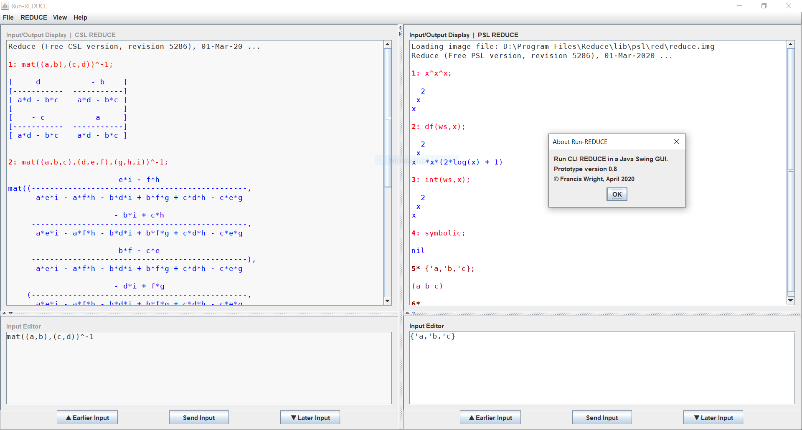

## [Click Here to Download Run-REDUCE.jar](https://github.com/fjwright/Run-REDUCE/releases/latest/download/Run-REDUCE.jar)

Run-REDUCE is a Graphical User Interface for running the REDUCE
Computer Algebra System that provides a consistent user experience
across all platforms.  It is implemented in Java and the executable
application takes the form of the JAR file `Run-REDUCE.jar`.  Click on
the link above to download the latest release.

REDUCE itself is an open source project available from
[SourceForge](https://sourceforge.net/projects/reduce-algebra/), which
you need to install separately.  Run-REDUCE is designed to run a
standard installation of REDUCE; it does not include REDUCE.

Full information about how to install and run Run-REDUCE is available
in the [User Guide](UserGuide.md).

Run-REDUCE is still under development but here are some of the key
features that it currently provides:

* Commands to run various versions of REDUCE that are fully
  configurable but default to running the distributed CSL and PSL
  versions as appropriate for the standard distributions.
* A REDUCE input/output display pane that scrolls in both directions
  as necessary and supports copying but not editing.  Its contents can
  be saved to a file and/or erased.
* A multi-line input editing pane that also scrolls in both directions
  as necessary.  Previous input is remembered and can be scrolled
  through, edited and re-input.  A final terminator can be added
  automatically if appropriate when input is sent to REDUCE.
* Options to make the REDUCE input prompt bold and to colour the
  input/output display based on the input mode or redfront.
* Menu options to handle REDUCE file input/output and load standard
  REDUCE packages, similar to the facilities provided by the CSL
  REDUCE GUI.
* Easy access to the Run-REDUCE User Guide and all the standard
  documentation distributed with REDUCE as HTML or PDF files.
* Support for the native and Motif look-and-feels as alternatives to
  the Java default ("Metal").
* Split or tabbed panes running independent REDUCE processes.

In future I hope to implement typeset-style display of mathematics
that supports copying and pasting as input.

Francis Wright, April 2020
